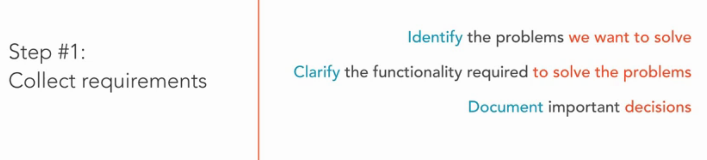
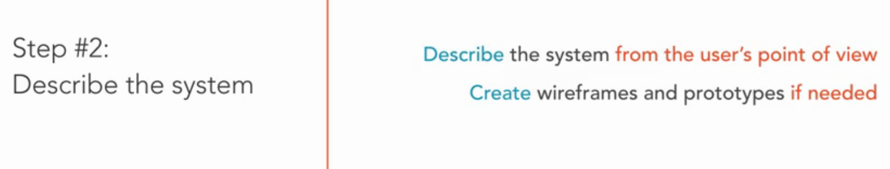

# Fundamental 
Building an object-oriented application requires some preliminary steps.

## 1. Collect requirements
In this step, we need to answer some questions:

## 2. Describe the system
Afer collecting requirements, we go to next step: describe the system:

## 3. Identify the classes.
In this step, we need to identify the classes to represent things that make up the system. Such as we need a class to represent a Student that has name, grade, age as properties. Or a class responsible for securely communicating with a server:

## 4. Create diagrams
Base on previous step, we draw some UML diagrams that describe the system:
* Class diagram: describe the relationship between classes that make the system. 
* Use cases diagram: list actions base on each user.
* Activity diagram: describe activitys with the system.
* Sequence diagram: steps which need to perform an action.
