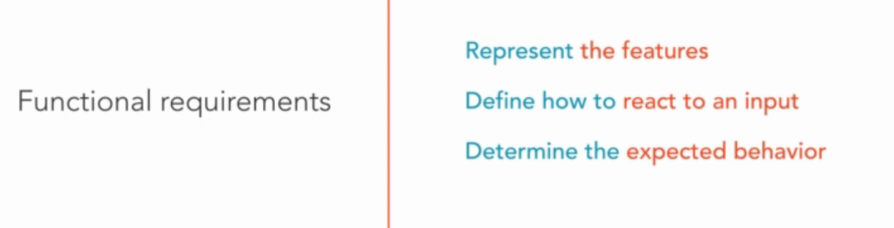
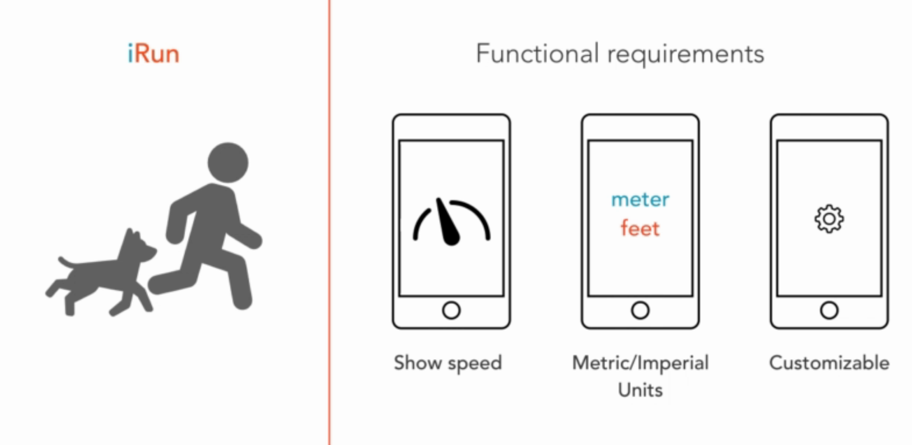
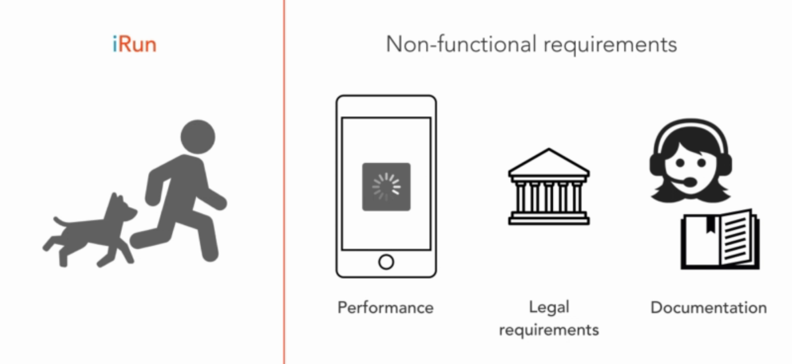

# Collecting Requirements
This is initial step when design an object-oriented application. So it is important, because it will affect to other step. We must clarify what's needed or wanted in out application. There are two important things we need to define:

## Functional requirements
This is features the application should have. 

Let see an example: An app for runner.

We should answer some questions like:  
Should the actual speed always be visible on the main screen?   
Do we allow imperial and metric units?  
Should we make this configurable by the user?

## Non-Functional Requirements
These are the requirements that are not directly related to a feature or behavior of the software system.
With the runner app, we may to answer these questions:

## Way to collect requirements
The simple way to list the function and non-funtion requiements is just write them down. 

## With each methodologies
If we are using a Waterfall approach, we have to clarify all the requirements in advance.   

For Agile projects, it's perfectly acceptable if we proceed without have answer for some questions. We may even miss some of the questions. Agile lets us revisit and refine the requirements.

