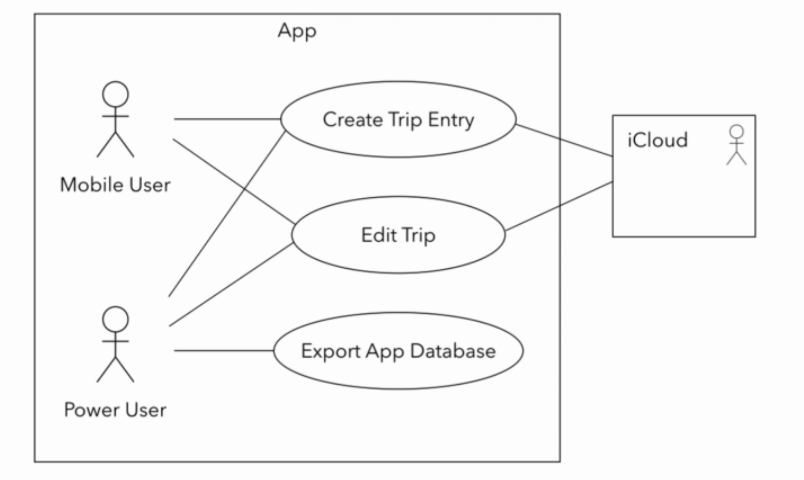

# Use Case Diagrams
It's the simplest UML diagrams. Its purpose is to visualize the functional requirements of the system. Use-case diagrams show groups of related use-cases. Sometimes they may include all the use-cases, the result is an overview of the system that may include several written use-cases.

To represent a use case, we draw an oval in the middle of the screen and put the title of the use case in it. Like "Create a Trip Entry", "Edit Trip", "Export App Database".  

We use stick figures to represent the actors like Mobile User, Power User. Actors are human beings or other systems that may interact with our system. We draw the stick person to the left or the right of the diagram. The actor's name goes below the stick figure. We usally draw primary actors on the left side and the secondary actors on the right side of the use case diagram.  

Next, we draw a line to represent interaction between actors and use-cases.  

iCloud system is used to backup data, data about Trip will be stored in the cloud. This actor is a system and is drawn inside a square. ICloud is not in our app, so it is placed outside.   

The use case diagrams give us a overview of the system. We can't go wrong if we focus on the actors, the use case and their interaction. But Use case diagrams don't replace use case descriptions.