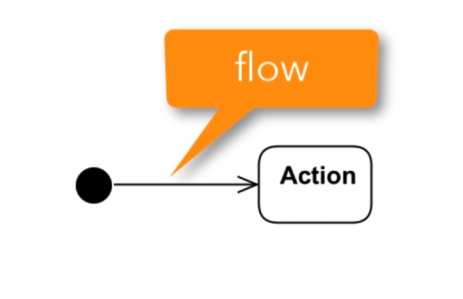
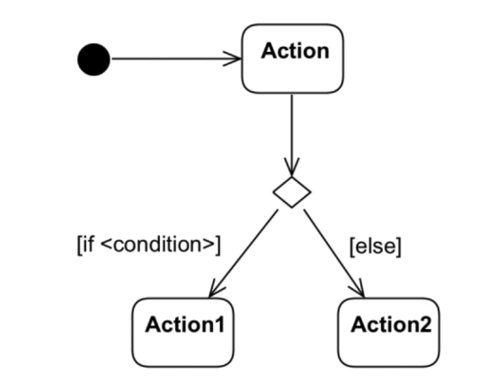
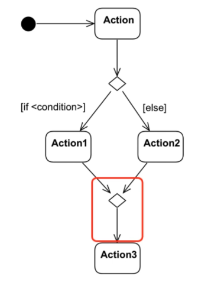
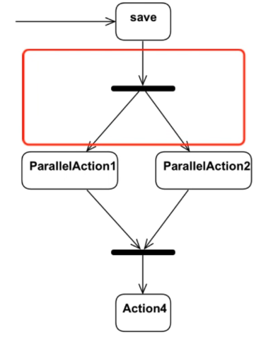
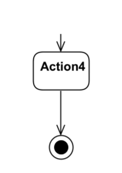
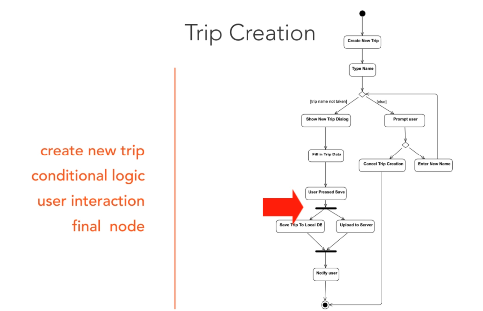

# Activity Diagrams
Activity Diagrams can be used to describe workflows. The actions are represented by nodes. 

## Start point
We start an activity diagram with an initial node drawn as a small filled circle. 

Next, we can then transition to the next node, the transition is called flow.

## Conditional logic
Activity Diagrams can also express conditional logic. 

After the condition, the flow can be merged using a merge activity. A merge has multiple input flows and a single output.

## Parallel Behavior
Activity diagrams support parallel behavior. To express concurrent flows, we use a fork drawn as a thick horizontal line. A fork has one incoming flow and several outgoing concurrent flows.

We need to synchronize the tasks that execute concurrently. A join represents a synchronization point.

## End point

## An example of activity diagram

