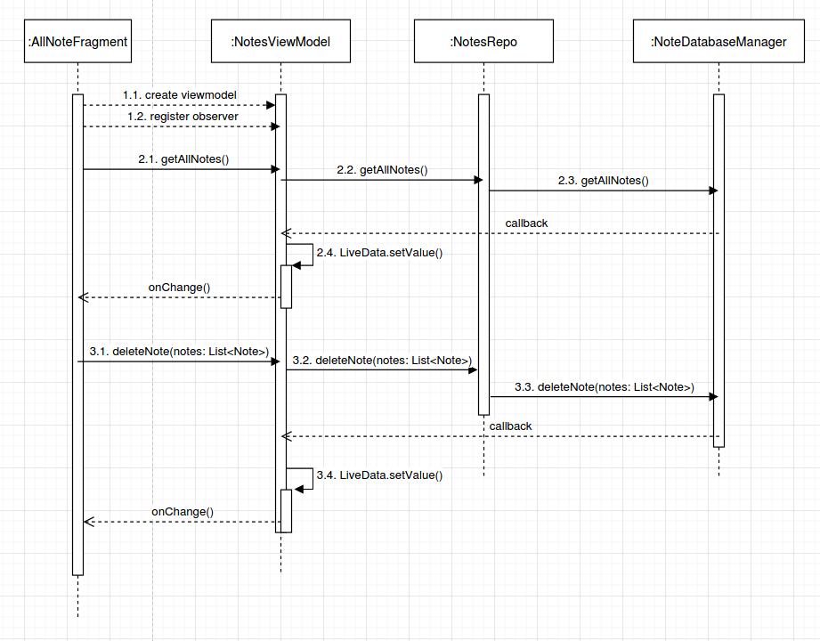
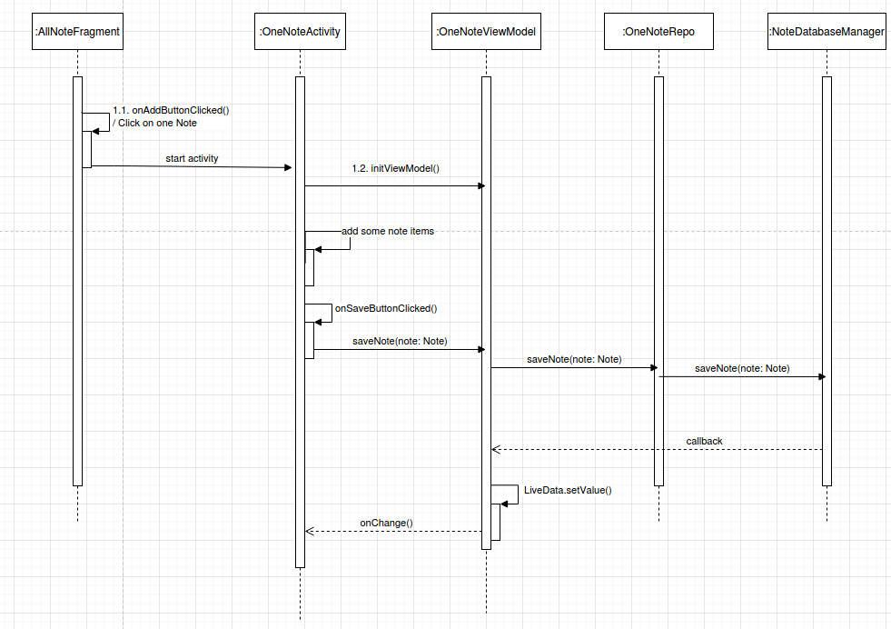

# Sequence Diagram for create, update, delete, get notes from database
AllNotesFragment, LockedNotesFragment, FrequencyNotesFragment, CategoryNotesFragment all can get, delete and edit notes, but only in AllNotesFragment, user can create a new note. 

## Get, delete. 

## Create new note / edit note.

