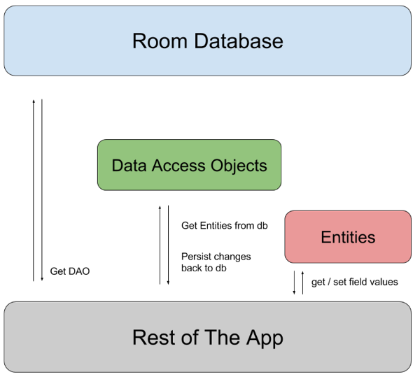

# Room Database
I am going to use Room database to store notes in our application. There are three main parts in Room database:



1. Entity
```
@Entity(tableName = "Company")
public class Company {

   @PrimaryKey(autoGenerate = true)
   @ColumnInfo(name = "id")
   private int companyId;

   @ColumnInfo(name = "name")
   private String name;

   @Ignore   
   Bitmap picture;
```
@Entity - by using this annotation, Room will know that this class will be a table in the database and tableName will define the name of the table.  
  * @PrimaryKey - is used to set up the primary key of the table. 
  * @ColumnInfo - defines the name of the column from the table if we don't want to use the name of that field.
  * @Ignore - the field or the constructor that has this annotation will be ignored by Room, so it will not be used.
2. DAO (Data Access Objects)
```
@Dao
public interface CompanyDao {
   @Query("SELECT * FROM Company")
   List getAllCompanies();

   @Insert
   void insertCompany(Company company);

   @Update
   void updateCompany(Company company);

   @Delete
   void deleteCompany(Company company);
}
```
By define this interface, Room will automatically generate for us the implementation of CRUD operators for our entity.  
 3. Database  
The @Database component combines the entities and the dao interface.
```
@Database(entities = {Company.class}, version = 1)
public abstract class AppDatabase extends RoomDatabase {   
   private static AppDatabase INSTANCE;

   public abstract CompanyDao companyDao();
   public static AppDatabase getAppDatabase(Context context) {
       if (INSTANCE == null) {
           INSTANCE = Room.databaseBuilder(context.getApplicationContext(),
                      AppDatabase.class, 
                      "company-db")                           
                      .build();
       }
       return INSTANCE;
   }
```
Inside of the @Database annotation we should define the list of the entities we want to be saved in the database and also the version of the current database. This number will help us to make the migration in Room.

At this level we are using an abstract class that extends RoomDatabase. Inside of it we define the abstract methods in order to have reference to our Dao classes and also we should create an instance of the database. In this case the instance is created using the Singleton pattern and the way to generate it is similar to the Retrofit builder.  

We have 2 possibilities to build the database by using:
* databaseBuilder that creates a RoomDatabase.Builder for a persistent database.
* inMemoryDatabaseBuilder that creates a RoomDatabase.Builder for an in-memory database, if we don't want to persist the data.
src: https://medium.com/@magdamiu/android-room-components-5a7458b99191