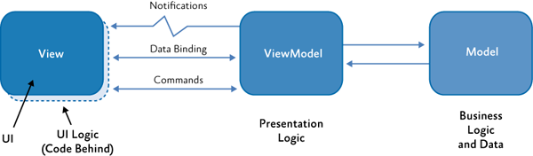
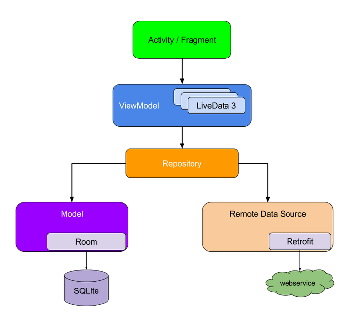

# Model-View-View Model (MVVM)
I am going to use MVVM architecture pattern in this project. There are three parts in MVVM: 

* Model: Represent business logic and data, in our app. It is Note, NoteItem, SecureNote class. Model will notify to ViewModel if have change detected.
* View: interact with user, pass commands from user to ViewModel. Receives notify from ViewModel to update UI. 
* ViewModel: communicate with View and Model. 

MVVM in layered model: 

Activity/ Fragment is our view in MVVM pattern. ViewModel with LiveData is used to notify change to view. Repository comunicate with model or remote data source to retrieve data then update live data, so that View can aware of changes. 