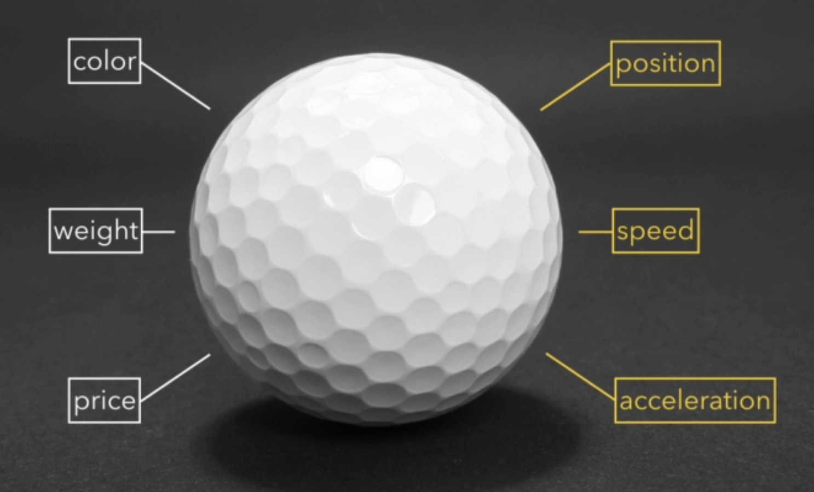
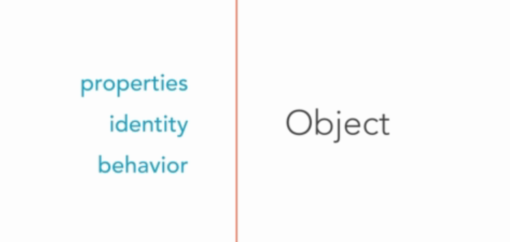

# Objects
While structured programming relies on actions, object-oriented programming is organized around objects.   
Objects represent a thing in the real life, objects can be simple or complex. A golf ball is an object, but so is Falcon Heavy. The way we define an object depends on the level of detail we need. Object can contain or refer other objects.  
We can describe objects using their properties. They can have attributes like name, color, weight, velocity... A gotf ball can completely white, it has a weight and a price. 



It has some properties that can change like position, speed, acceleration and some that don't change: color, weight, price.   

Each object has their own state, actions peformed on one object will not affect to other object. Do not change state of other objects. Each object has a private identity. Besides properties, indentity, objects can have behaviors. The behavior of an object is what it can do. 



Example:
```
The black dog barks
```
The object is a dog with a property is its color (black). The verb (barks) is its behavior. 

To represent objects in the world of object-oriented programming, we use Class concept.