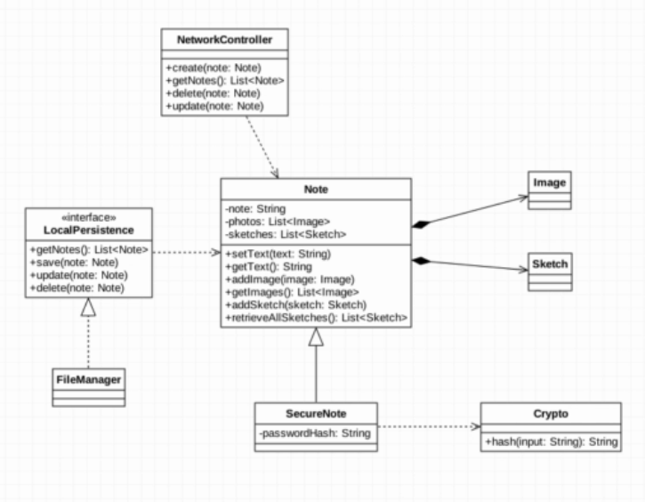

# Class Diagram
We represent classes in our system and the relationships between them. 

At this step, we do not go to deep details of how the classes are implemented, or we will be stuck. 

So at first, a Note class represents a note which include note in text, images, sketches. The relationship between Note and Image, Sketch is composition because if a note is deleted, all images and sketches will be deleted too.
The SecureNote class represents a secure note which inherits from Note class. It has one more attribute called passwordHash store the hash value of the password. A Crypto class is used to generate hash value for password. 

At this point, we do not know what system we may use to store Note, may be File System, SQL database... So make it abstraction by creating an interface called LocalPersistence.

A NetworkController class is used to update database to cloud.