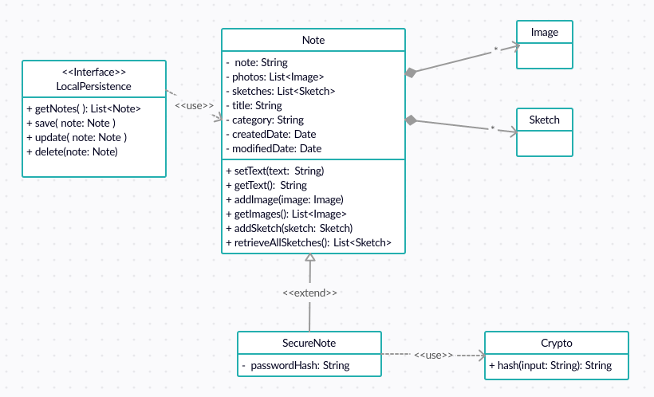

# Class Diagram
I represent classes in our system and the relationship between them. 
At first, I just draw it out simple, abstract to see which classes make our system. Then I will analyze further more, so that I can draw the diagram more accurately.

I need a class to represent a note and it's Note class, it includes text-based note, photos and sketches. There are multiple ways to represent an image, a sketch in android, I will analyze more to determine.  
A SecureNote (extends from Note class) represents for a secure note, it has an attribute called passwordHash which used to check the password. The passwordHash is generated by using hash function in Crypto class.  
At this step, I do not decide which kind of database I use, so that I just use an interface (LocalPersistence) to represent operators on database.