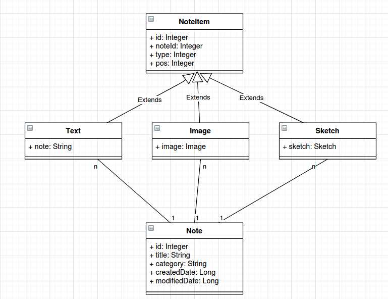
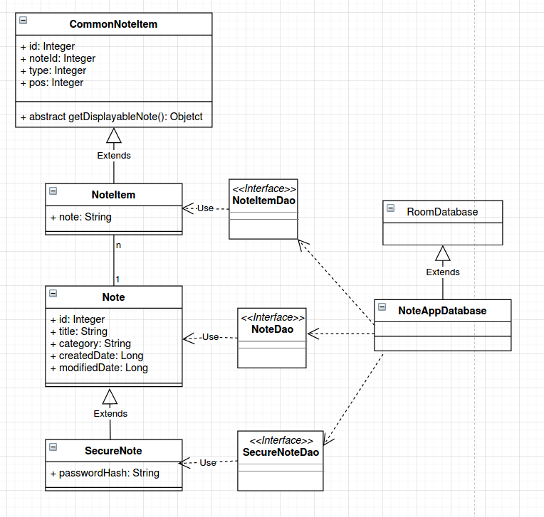

# Design database
The below class diagram is created by using draw.io  
I want to display a note as a list of item such as text, images and sketches. So that except common information such as title, category, created date, modified date, a note refer to different items. Because a entity class represent a table in room database, I create a class diagram to show how database is designed.

Let's analyze further more. An image can be represented by a path to it in file system, so it can be stored in database as a string. A sketch is list of point which can be stored in string as well. So I can simple the diagram as follows:  

With this diagram, I can add other note item to the system easily. 

