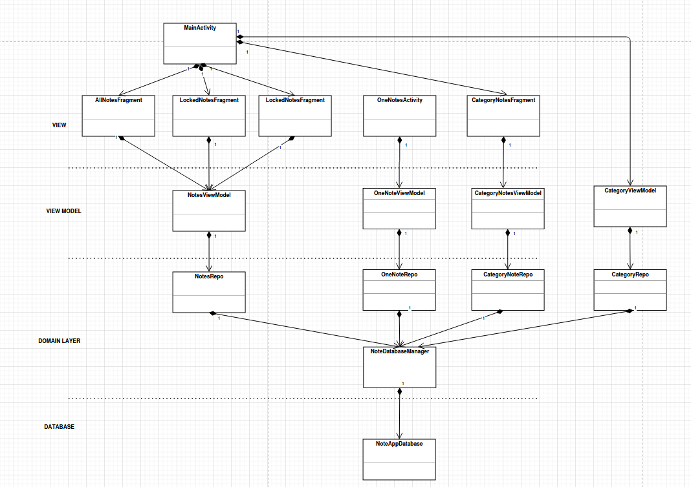

# Class Diagram in layers.

AllNoteActivity is main screen which displays all notes in list.  
When user clicks on one note, it go to the OneNoteActivity. Or when user create new note, app will go to the OneNoteActivity where user can add text, images or sketches.   
NoteViewModel, OneNoteViewModel, CategoryNoteViewModel contains live data to notify view about data changes in the note database.   
CategoryViewModel contains live data to notify view about data changes in the category database.  
Repos contain logic code such as sorting, filter...   
DatabaseManager contain code to retrieve, update, delete, insert data from/to database.   
The rest of database is drawn in DatabaseDesign section.