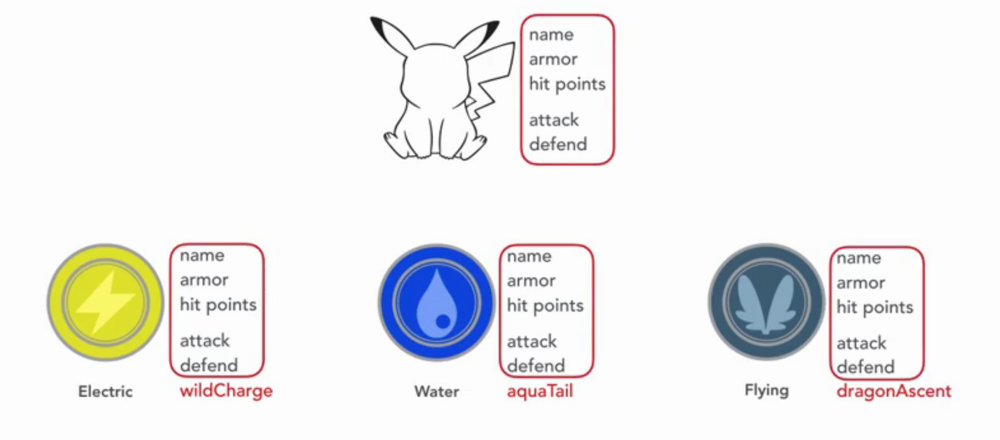
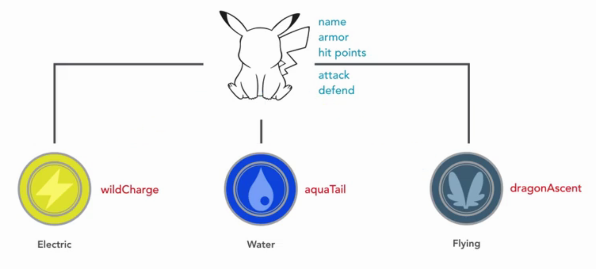

# Inheritance
Inheritance is a key concept in object-oriented programming. Without inheritance, we have to write similar code again and again. Inheritance means that reuse codes.  
Let talk about Pokemon example, in previous concept, we modeled the Pokemon class with the main properties and behaviors, what if we have Electric, Water and Flying Pokemon. Each of them has their own behavior, but they still have same properties and behaviors as Pokemon class. 

We can add all the new behaviors to just one class Pokemon and use it to create Pokemon object. But the Pokemon will become a huge class and has many responsibilities which is a bad design. In object-oriented programming, one object is designed to have a single responsibility.  
So we should have three classes to represent three type of pokemon. But we have same properties and behaviors in these class, it make duplicate code. And that is not good design too.   
Object-oriented programming introduces new concept called inheritance. That mean that one or many class can inherit from another class and use the properties and behaviors of this class. So that we make three classes inherit from Pokemon class, so that we can use the main properties and behaviors in Pokemon class and write new behaviors or properties in the specific class. 

In OOP, The Pokemon class is called superclass, and three Pokemon type class is subclass.