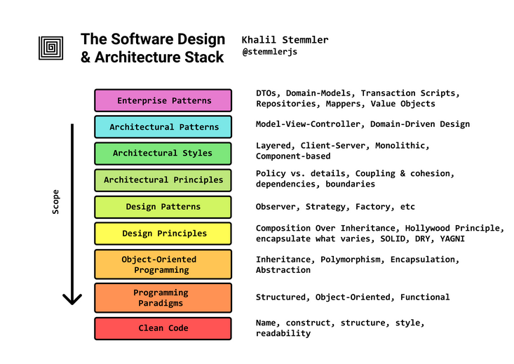

# A Tree Knowledge for Software Design.
I start learning Software design base on the [post](https://khalilstemmler.com/articles/software-design-architecture/full-stack-software-design/). Thanks the author, it is well-defined roadmap to learn about software design.

