# Methodologies
There are different ways to develop a software system. Sure, you can sit down and just type code. It work, but when something needs to be changed, some new features added, the code will be complicated and hard to extend. 

```
"Sotfware development is much more than just typing code!"
```

For anything more complicated than a Hello World app, you'll need a way to organize your work. Now, different approaches have been invented. We will talk about two different approaches:  
* The waterfall model: requires you to have a detailed plan before stating any code. The requirements need to be fixed, no change expected during development.

* Agile approach: change-friendly, which great for projects where the expectations can change rapidly and frequently. 

But: 
```
"There are no perfect methodology."
```

## The waterfall model
The waterfall is linear model. It defines development steps and phases, you start executing one step, complete it and then go to the next step. 

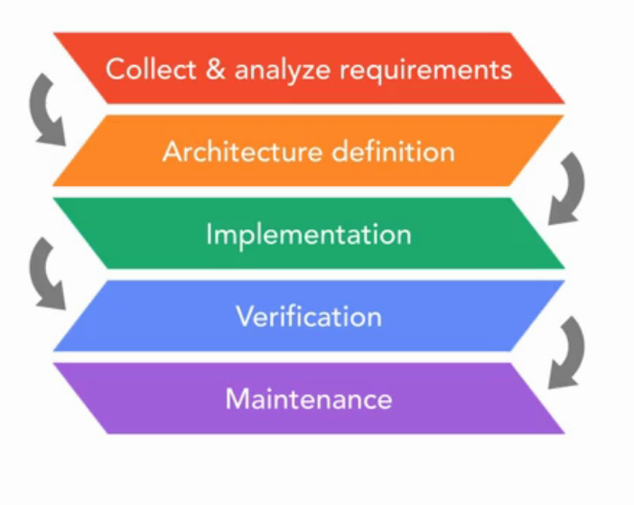

This approach gives us a steady, downward order - hence the name "Waterfall".

### Collect & analyze requirements
First step is to collect and analyze requirements, so the model can produce the expected outcome. 

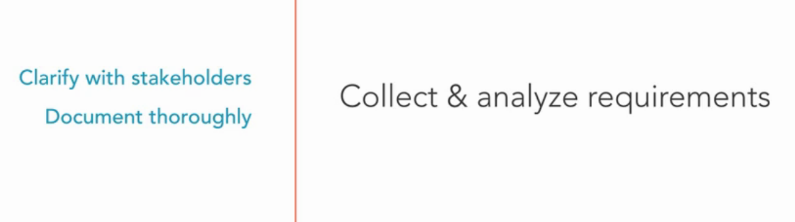

### Architecture definition
After the expectation get done, we can defines the architecture of the software. Defining the architecture is like creating the blueprint for a building.   

So it should as clear and detailed as possible. The team should able to implement software base on the architecture. 

We should answer some questions:  
"
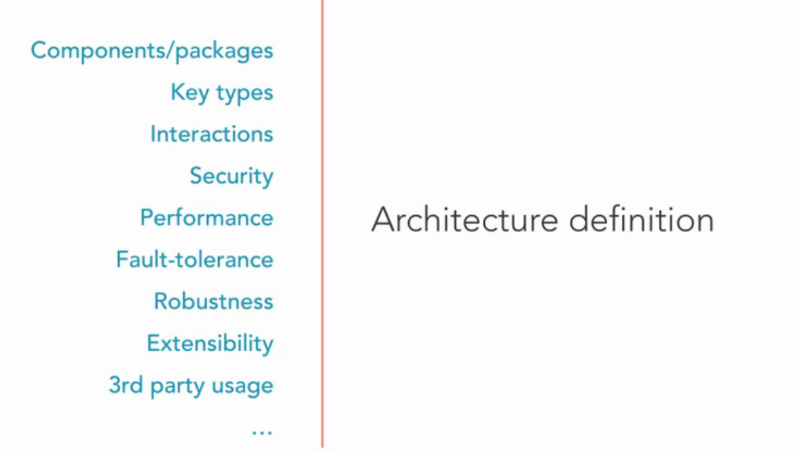

"Which packages or components will form our system?"

"What are the fundamental types of each component?"

"How do these types interact with each other to achieve the required functionality?"

"Is our software secure?"

"How about performance?"

"How does our software respond to errors?"

"How do we handle edge cases?"

"Should we extend our system in the future?"

"Which third-party components do we use?"

### Implementation
The implementation phase come next. The processes include coding and testing which are performed by developers.

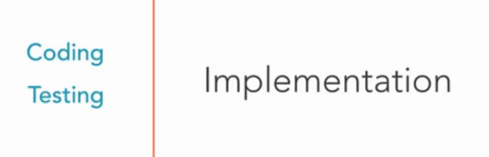

### Verification
We must check whether the product provides the functionality we agreed on. Tests are executed to ensure that the sotfware works as expected.   

We test on functional, peformance, security and usability. 

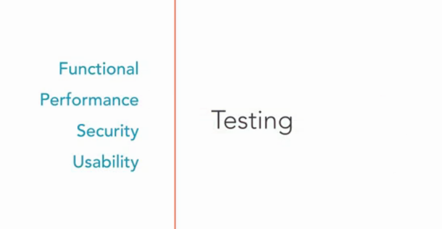

Critical issue will be fixed in this phase. Issues which effect to the release plan will also be fixed. 

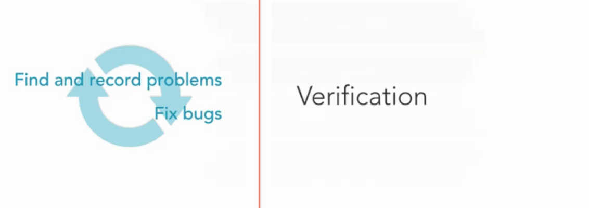

### Maintenance
After verification phase, a version of software will be release. In this phase, smaller issues will be detected and fixed. 

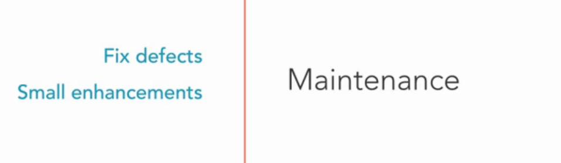

The waterfall model is used for life-control, medical and military systems. This model requires us to clarify all the requirements and create plan upfront. 

We can use this model successfully, if the requirements are precisely defined and won't change over time. 

## Agile Framework
Agile is a relatively new approach to sotfware project management. The Agile approach defines four value:

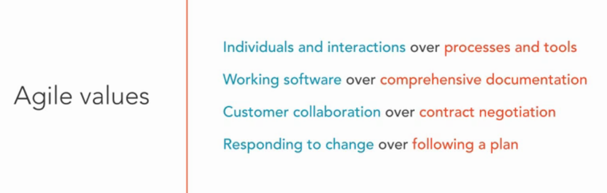

### Individuals and interactions over processes and tools.  
This doesn't mean that we won't use processes and tools in agile projects.  We still need tools and processes, but they shouldn't prevent us from implemeting the required features or changes.   
Agile projects implement adaptive processes. Instead of enforcing people to follow a rigid process, we basically implement a process that's adaptive and responds to changes. 

### Working software over comprehensive documentation.

This doesn't mean that agile projects don't use documentation at all. We should create documentation that provide value. There are no need to create extensive documentation just for sake of it.

### Customer collaboration over contract negotiation.

Agile projects also require contracts to manage customer expectations about costs and schedules. But unlike for plan driven projects, there is a spirit of partnership between the development team and the customer. 

### Responding to change over following a plan. 
The Agile welcomes changes even at the later phase of the development cycle. Some plan is still needed for the agile project, but we do not come up with a detailed plan for entire project. 

### How the Agile approach solves the problem.
The main idea behind the Agile approach is split the whole project into small chunks which implement a features, then testing, fixing and go to the next chunks. 

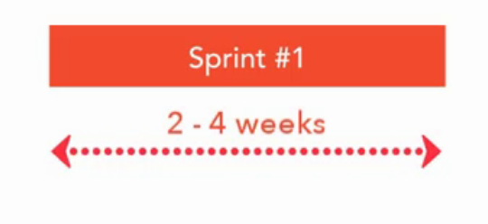

This interactive approach provides an opportunity to frequently review the product that's being developed. No need to wait until the final product is released. 

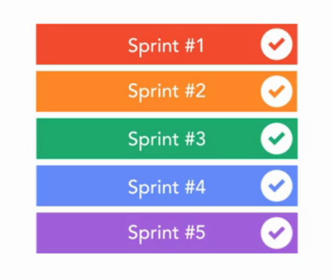

Unlike the waterfall model, this approach does not separate testing from development. 

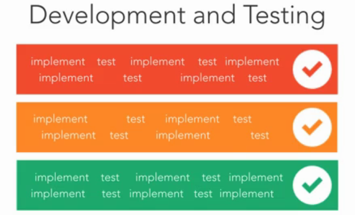

This model works best in situations where the requirements can't be defined upfront. Agile is a good fit for software projects that are depending on many uncertain factors and changes are to be expected. 