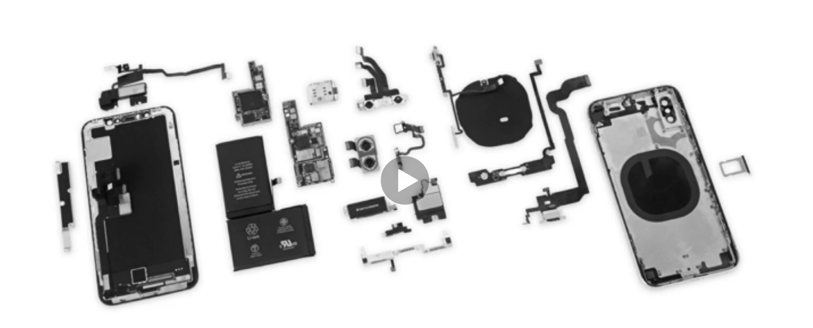
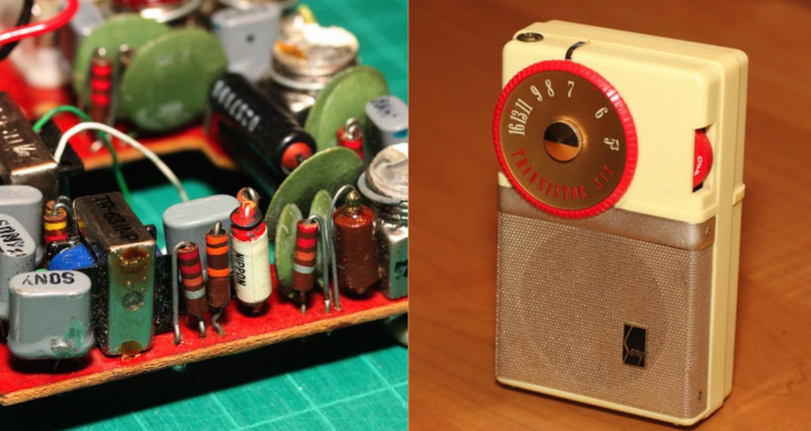

# Encapsulation and Data Hiding. 
This is a key idea in object-oriented programming. We encapsulate something to protect it and keep its parts together. Think of how medicine is enclosed in a shell called capsule.   
In object-oriented programming, this translates to packing together our properties and methods in an class. It help us separate the whole thing into some object. Let see an example:

We can use a phone without understanding electronics. We don't need to know how the touchscreen, keyboard, logic board works. We only need to know how to interact with the screen. These things connect with each other and make up the phone. It's same with a software which is created by combining many objects, each of them provides only essential features and hides its internal details. 

The object is protected from external interference. We restrict clients from modifying the object in ways we did not originally plan. 

Additionally, we prevent other parts of the system from relying on properties and behaviors that may change. If you replace your phone's battery, that won't affect the way you use your phone. Or you can change the screen in case it is broken.   
If we expose unnecessary details, any changes to attributes or methods that may affect other parts of the system. But, if we restricted access to that data or behaviors, we don't have to worry about the ripple effect of our changes. 

Rule: When designing your classes, expose only as much detail as needed. 

Data hiding plays an essential role in keeping the dependencies between objects to a minimum. If objects refer to each other, when you change in one object, you have to change to another too. Update and maintain such system is pain. 
