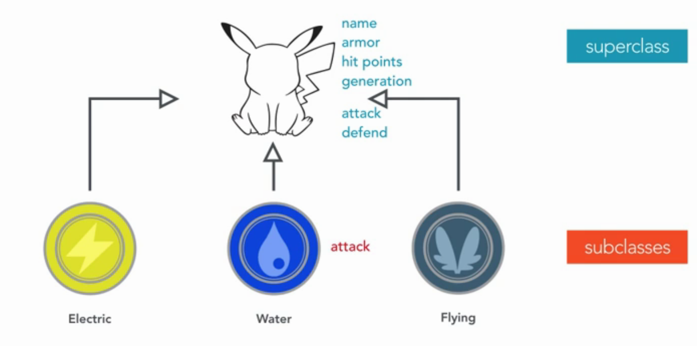
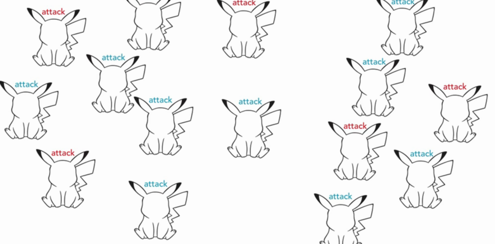

# Polymorphism
Here's another term when come to object-orientation: Polymorphism. The word has two part:


This word mean that the condition of occurring in several differnent forms. But how it apply to programing? Let's revisit the idea of inheritance.



Electric, Water and Flying pokemons are inheritance from Pokemon superclass, so they have same properties and behaviors as Pokemon class. But what if we want Water pokemons cause more damage than basic Pokemon? We have to re-implement attack method in the Water pokemon class, this method have same name same form as base class but have different body. That's overriding method. 

Polymorphism let's us work with objects created from any of these classes, we don't need to know whether it's a Water, Fly or Electric pokemon instance to call any common method define in the supper class. We can create many pokemon instances, and call attack method, each one of them will know to execute the right behavior. 



Let see this example in Java code:
```
import java.util.ArrayList;

public class Main
{
    public static void main(String[] args) {
        ArrayList<Pokemon> pokemons = new ArrayList<>();
        Water squirtle = new Water("Squirtle");
        Electric pikachu = new Electric("Pikachu");
        Flying charizard = new Flying("Charizard");
        
        pokemons.add(squirtle);
        pokemons.add(pikachu);
        pokemons.add(charizard);
        
        for (Pokemon pokemon : pokemons) {
            pokemon.attack();
        }
    }
    
    static class Pokemon {
        private String name;
        
        public Pokemon(String name) {
            this.name = name;
        }
        
        protected void attack() {
            System.out.println("Pokemon attack!");
        }
    }
    
    static class Water extends Pokemon {
        
        public Water(String name) {
            super(name);
        }
        
        @Override
        protected void attack() {
            System.out.println("Water Pokemon attack!");
        }
    }
    
    static class Electric extends Pokemon {
        public Electric(String name) {
            super(name);
        }
    }
    
    static class Flying extends Pokemon {
        public Flying(String name) {
            super(name);
        }
    }
}
```
