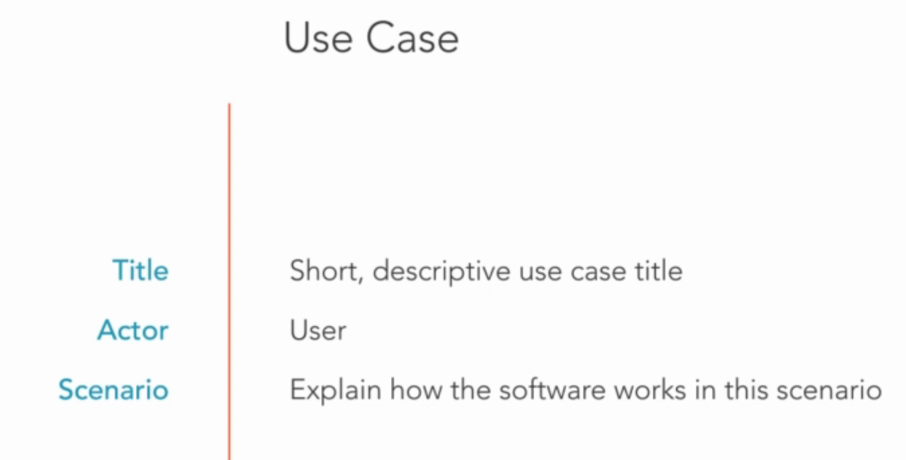
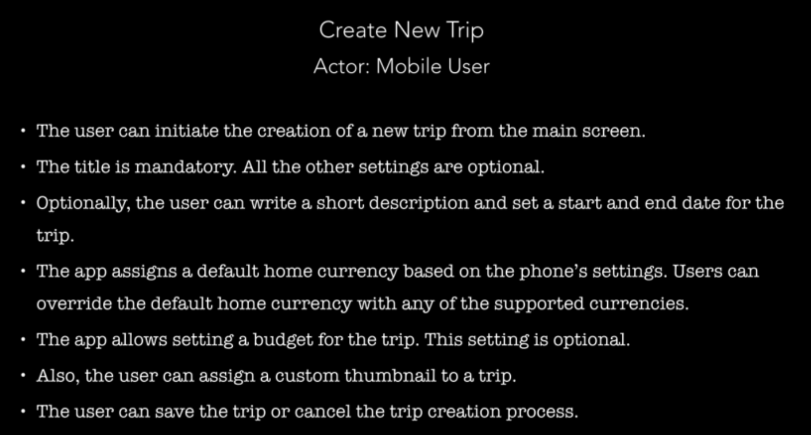
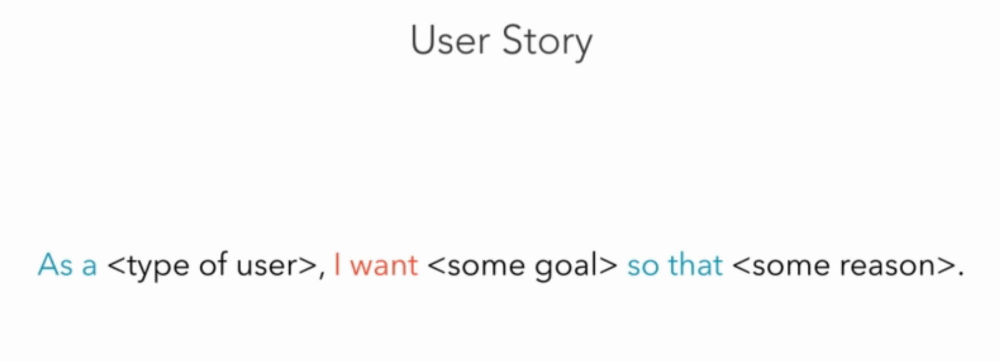

# Mapping Requirements to Technical Descriptions.
There are many ways to map requirements to technical descriptions. This is where we provide short, accurate descriptions of our system's functionality from the user's perspective. 

## Use case
One way of documenting our system's features is through use-cases. Use-cases usually have form like this:



Title is something like "Create a new trip", "Edit Expense" or "Convert Currencies" which is one of features of our application. Actor is user of our app who using this features. Let see an example:


## User Story
Very brief descriptions of a feature. Follow the form:



Example:

```
As a user, I want to add notes to my expenses, so that I can identify them later on.
```
```
As a power user, I want to retrieve the app's database file, so that I can inspect it on any computer.
```
