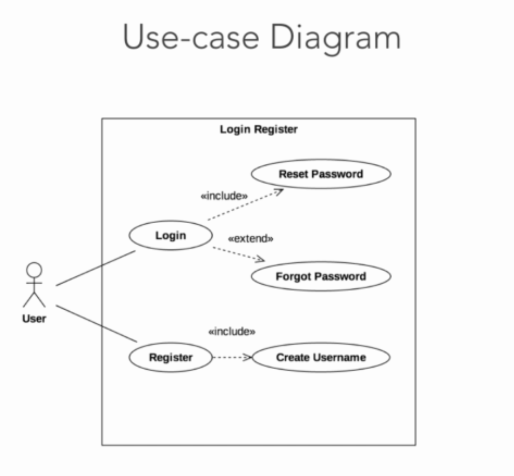
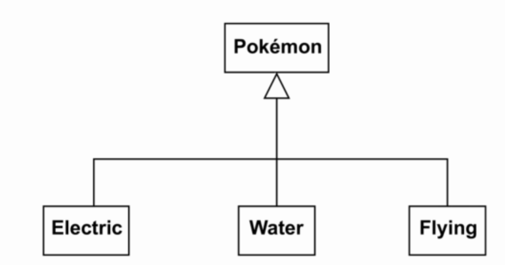
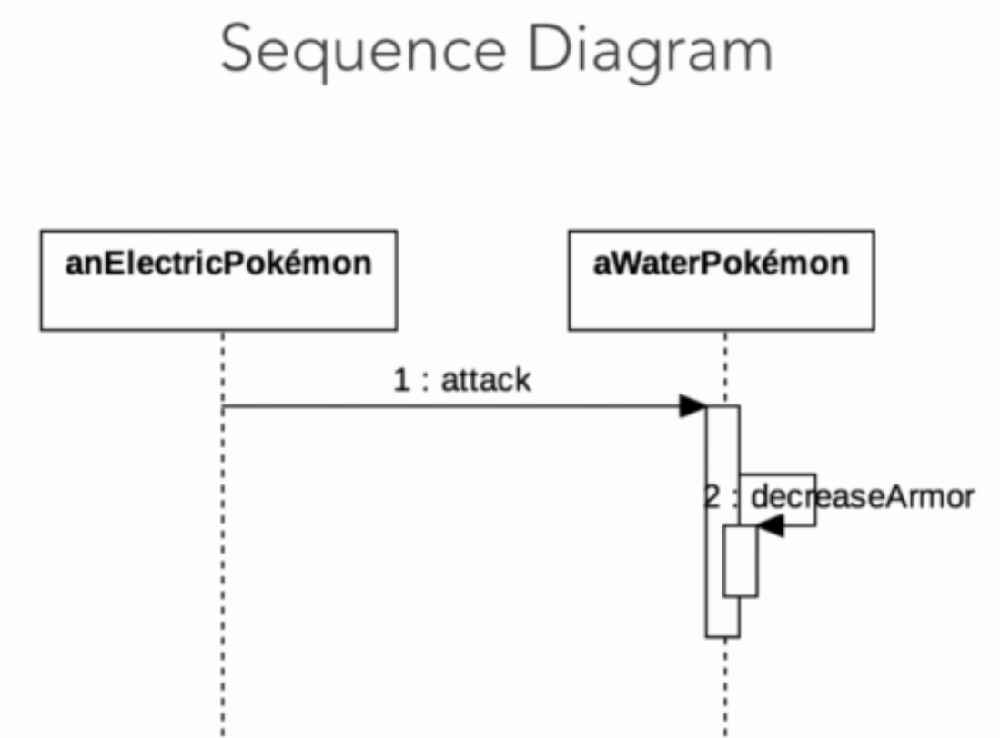

# UML
The Unified Modelling Language - in short, UML is not a textual language, but rather a graphical notation: a set of diagrams that help designing and communicating software systems. We can use these diagrams to describe the objects that form a system and their interactions. UML has many diagram. Here we discuss some main diagram:

## Use case diagram
The use case diagram describes the functional model of a system, that is, the functionality of a system from user's point of view. 

## Class diagram
To describe the structure of a system, UML provides structural diagrams. We'll talk about the class diagram which can be used to describe the structure of a system in terms of objects, attributes, operators and relations. 

## Sequence diagram
UML lets us model dynamic behavior, too. The behavioral diagrams describe the functionality of the system focusing on what happens, and the interactions between objects. 

UML diagrams become a standard graphical notation which used to describe object-oriented systems. The best part about UML is that it's independent of any particular programming language, but we can start coding an object-oriented software based on UML diagrams. 