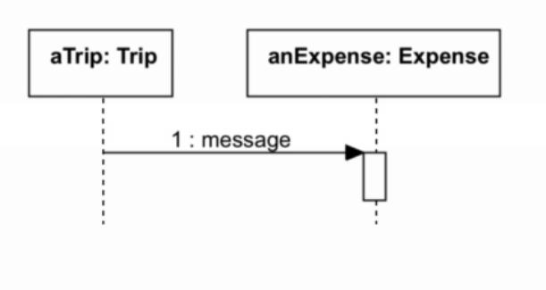
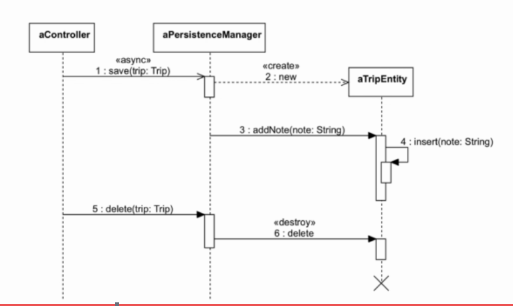

# Sequence Diagram
UML provides dynamic diagrams to represent how objects communicate with each other. The most common diagram is the sequence diagram. We use the sequence diagram to describe the flow of logic in one particular scenario. 

A sequence diagram is like:

Each box represent an object, the dash line is lifeline which show the time that the object exists. In the diagram above, the rectangle on the line is time the anExpense object exist. We can send a message from an object to another. A message is basically a method call. 

An example of sequence diagram:

The diagram above shows two scenario, one for save new trip object, and one for delete an exist trip object. 

There are four different types of line in this diagram:

* Async message (1): save new trip object to database is a slow operator which should use background thread. 

* Regular message (3, 5, 6): represent a normal method call on object. addNote() method is call on aTripEntity object. 

* Create message (2): used to represent a message that create new object. 

* Self message (4): It's a method call on the object itself. 

After trip object get destroyed, then its lifeline gets terminated by a cross symbol. After message 6. 

We don't need to represent all the method calls in a sequence diagram. Only focus on the most relevant parts. 