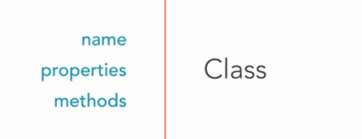
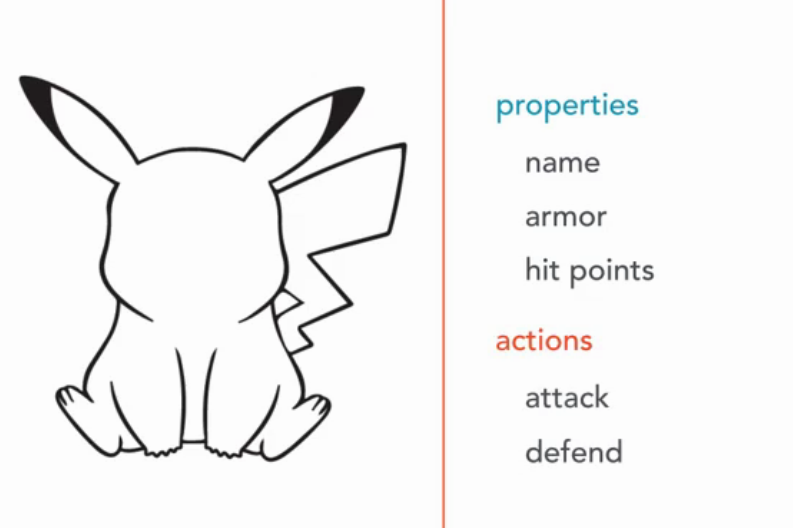
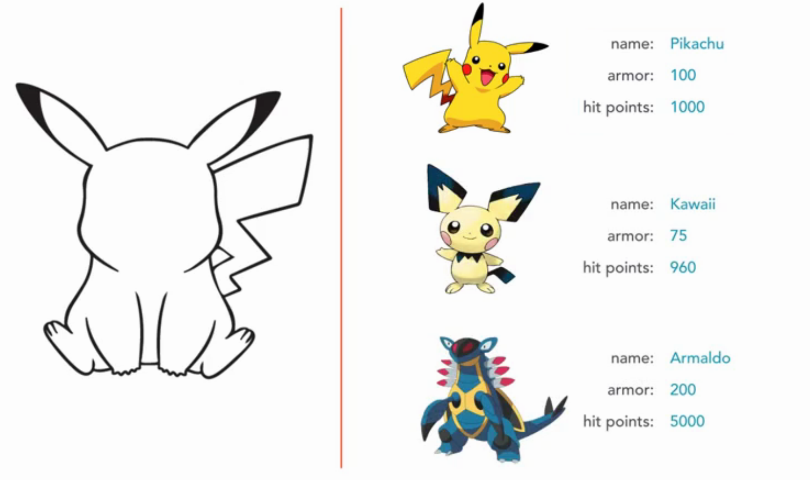

# Class
Building an object-oriented system start by identifying the potential objects, their attributes, and responsibilities. We need to have class before creat an object. Class is just a blueprint for object. Class is an decription or plan for object.   

Class has name, properties and actions (or method).

Name is used to identify the class and create objects. Properties is properties of object. Actions (or method) is just a block of code (function) which can be executed. Actions is behaviors of object.  

Let's see if we want to create Pokemon objects. First, we create a blueprint for Pokemon: a class called Pokemon (name)

And Pokemon has properties and actions as above. Then we can create many pokemon like: 

Also, class is used to create library, api to reuse code which will reduce time programing.