# Class Diagrams
Class diagram is most used uml diagram which describes the relationship between classes that create our system.
## One Class in Class Diagrams
A class diagram includes multiple classes, each one is represented by a rectangle:

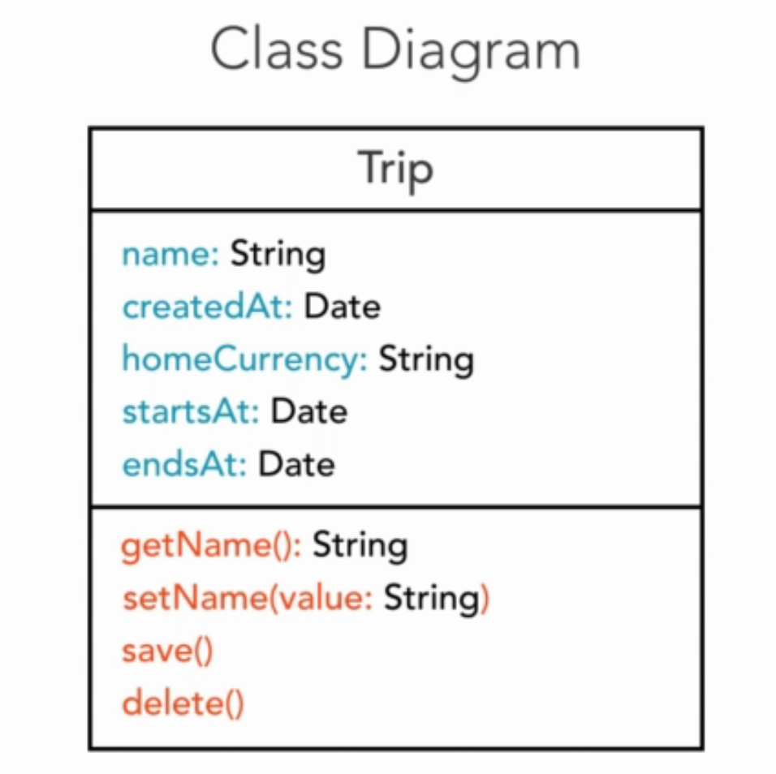

There are three parts in a class rectangle:

* The first is class name, in the shape above, class name is Trip. 
* The second is properties which are colored in blue.
* The third is methods which are colored in red.  

Class name follow the rule UpperCamelCase which means that the first letter of each word in class name is capitalized. While properties and methods follow the rule LowerCamelCase, with the first word is lowercase and the first letter in each word in the rest will be capitalized.

### Visibility

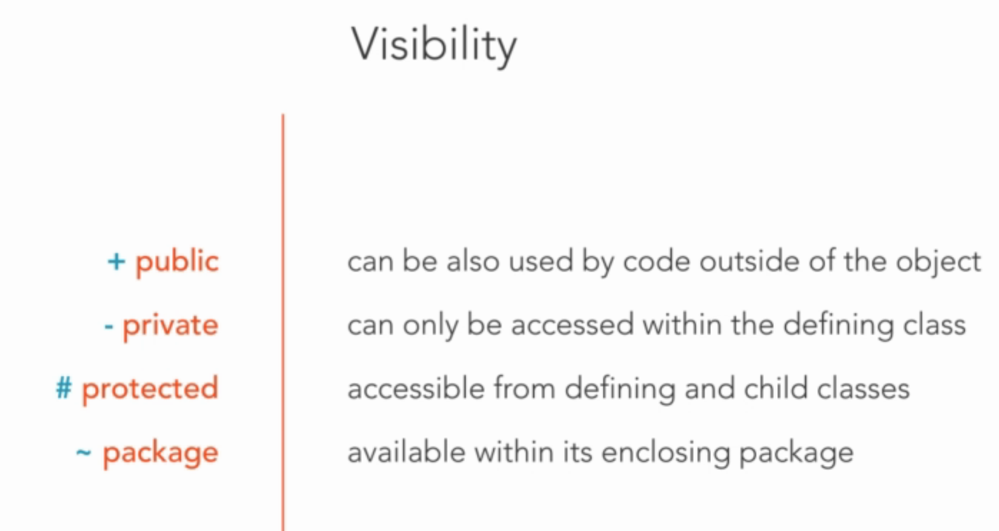

Example: 

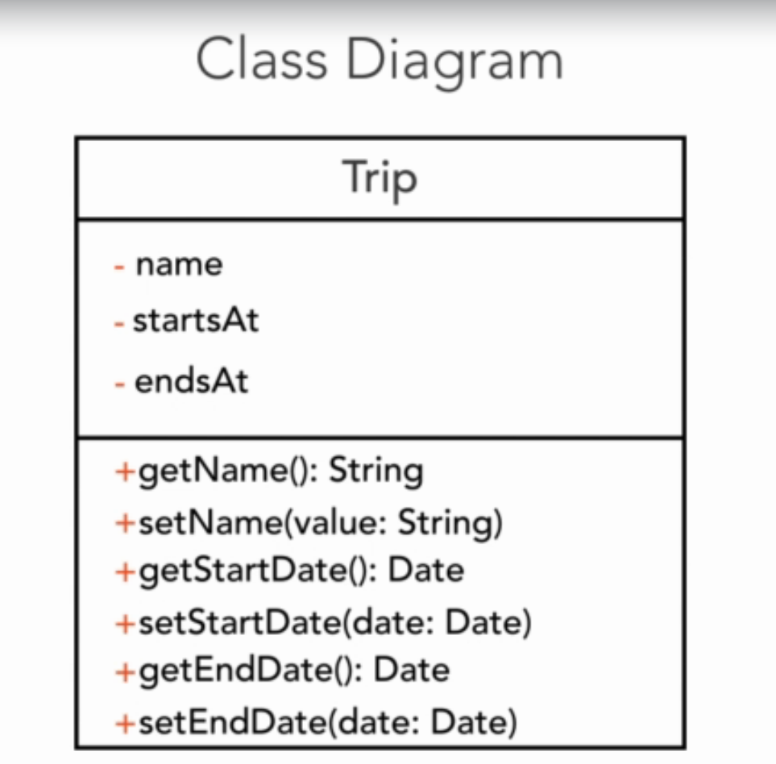

name, startsAt, and endsAt are private properties of the trip class while all getter & setter methods are public. Then we can check some conditions in setter before assigning values.

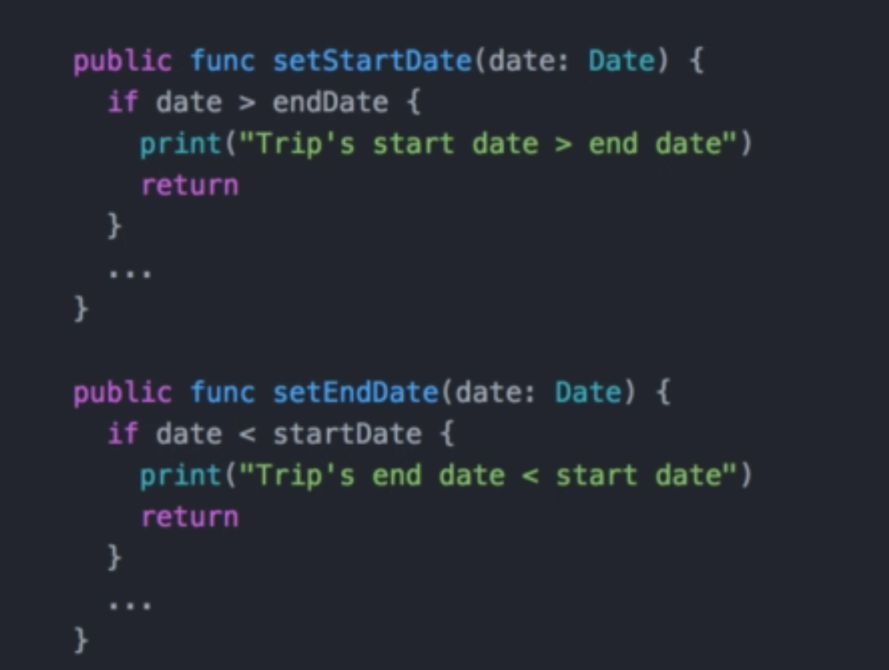

## Relationships
The next logical step after identifying the key classes in our system is figuring out the relationship between them. 
Use-cases or user stories will help us during this process. 
### Associations
Let's see an example with user story: 

```
The app must store travel expenses organized by trips.
```

So there should be a relationship between Trip class and Expense class: 

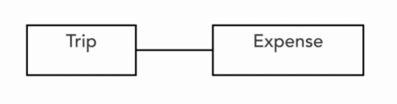

The solid line between the two classes represents an association. The association tells us that the classes refer to each other. The Trip class need to know about its expenses. But should the Expense also refer to Trip class?  

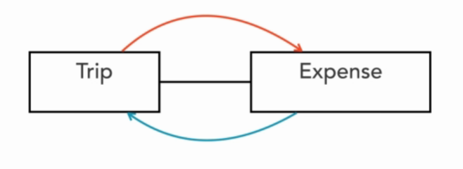


NO. We should avoid this situation. Here is the problem, if we tried to use the expenses class in other parts of the system, we have to bring with the Trip class. This doesn't make sense, as we should be able to use an Expense without a Trip class. Other problem is circle dependence (A->B->A). 

So only Trip class contains a refer to Expense class. 

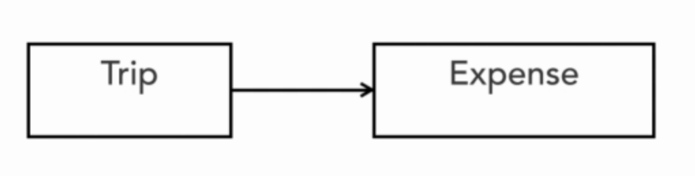


We can represent the multiplicity of associated objects as follow:

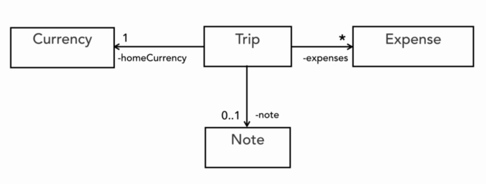

*- a Trip can have zero ore more Expenses.   

1-A Trip must have exactly one Currency.   

0..1-A Trip may or may not have a single note. 

The default multiplicity is one. 
We can also display the name of the property for the given association.

### Generalization 
We use generalization to express the one modle element is based on another model element. 

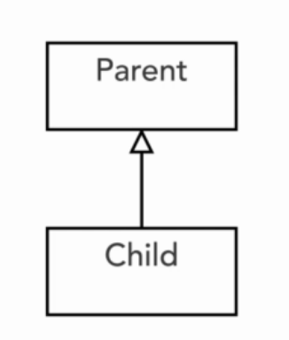

Generalization is represented as a solid line with a hollow arrowhead that points to the parent.  

Multiple class can inherit from one class:

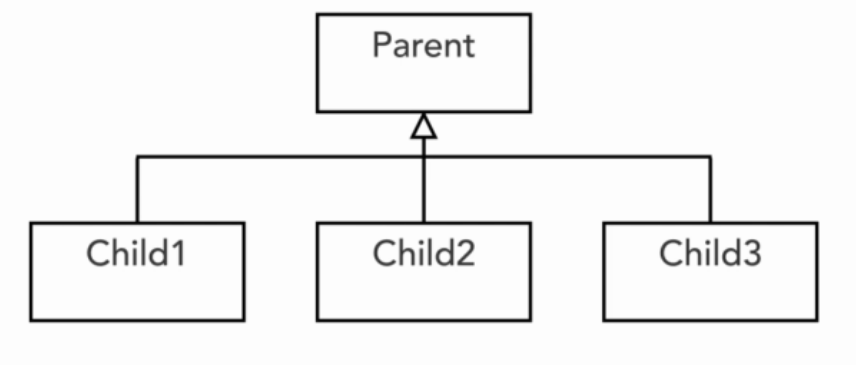

Or One can inherit from multiple parent classes:

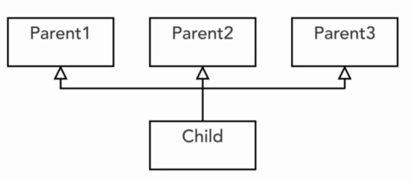

### Dependency, Aggregation, Composition and Realization

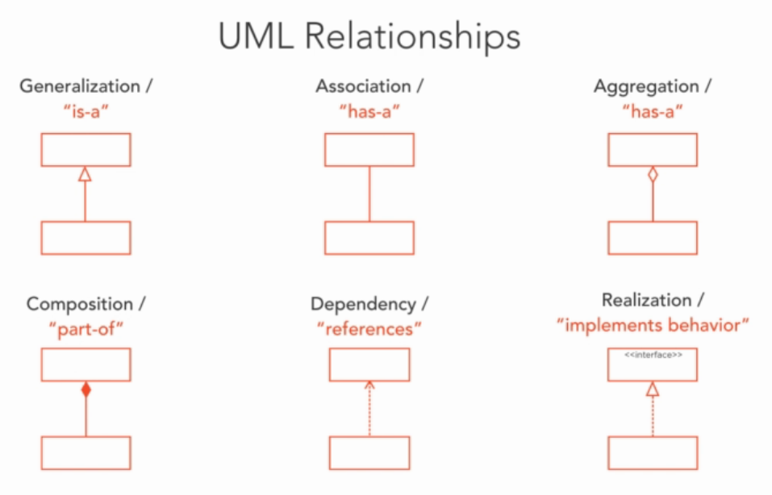

Dependency: If changes in one of the classes may cause changes to the other. Dependency is often confused with Association, but there are big differences:
* Association indicates that a class has an attribute of the other class's type. 
* While Dependency is created when a class receives a reference to the other class, for instance, through a member function parameter. 

Aggregation is same as Association relationship.

Composition: is a stronger form of association. It shows that the parts live and die with the whole, in other word, composition mean ownership. When an instance of a class is destroyed, the contained objects will be destroyed, too. 

Realizaion: represent a class implement the behavior specified by another model element (abstract class or interface)

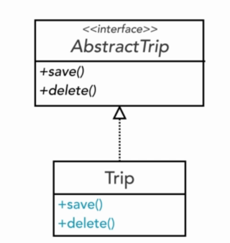

This is a useful feature that allows polymorphic behavior.